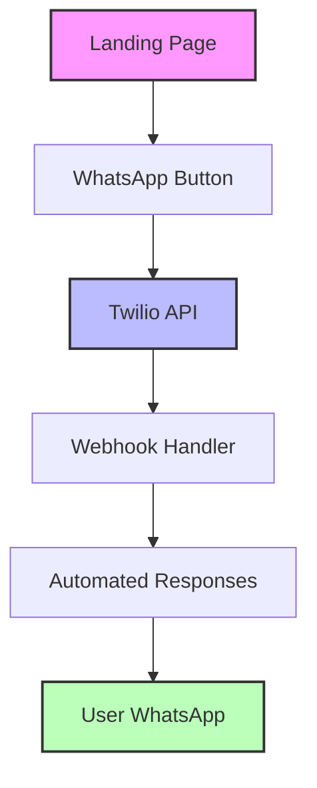
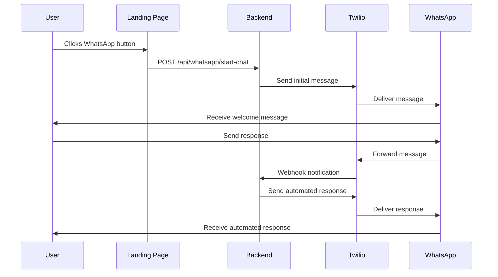

# AgroTalent 🌾


A platform connecting agricultural workers with job opportunities in the field.

## 🌟 Features

- Landing page with responsive design
- WhatsApp integration for instant communication
- Automated response system
- Job posting and application system

## 🏗 Architecture



## 🚀 Getting Started

### Prerequisites

- Node.js 16+
- npm or yarn
- Twilio account
- WhatsApp enabled phone number

### Installation

1. Clone the repository
```bash
git clone https://github.com/yourusername/field-jobs-platform.git
cd field-jobs-platform
```

2. Install dependencies
```bash
npm install
```

3. Configure environment variables
```bash
# Create .env file in whatsapp-bot directory
TWILIO_ACCOUNT_SID=your_sid_here
TWILIO_AUTH_TOKEN=your_token_here
TWILIO_WHATSAPP_NUMBER=+14155238886
PORT=3001
```

4. Start the development server
```bash
npm run dev
```

## 📱 WhatsApp Integration

### Flow Diagram



### Features

- Instant connection through WhatsApp
- Automated response system
- Menu-driven interaction
- Real-time message handling

### Response Menu

1. **Initial Contact**
   - Welcome message
   - Main menu options

2. **Menu Options**
   - View job opportunities
   - Post a job
   - Speak with an advisor

3. **Automated Responses**
   - Customized responses based on user selection
   - Option to connect with human advisor

## 🛠 Technical Stack

- **Frontend**:
  - React
  - TypeScript
  - Tailwind CSS
  - Vite

- **Backend**:
  - Node.js
  - Express
  - TypeScript
  - Twilio SDK

## 📦 Project Structure

```
project/
├── src/
│   ├── components/
│   │   ├── WhatsAppButton.tsx
│   │   ├── CTASection.tsx
│   │   └── ...
│   └── ...
├── whatsapp-bot/
│   ├── src/
│   │   ├── config/
│   │   │   └── twilio.ts
│   │   ├── controllers/
│   │   │   └── whatsappController.ts
│   │   ├── routes/
│   │   │   └── whatsappRoutes.ts
│   │   └── app.ts
│   ├── .env
│   └── package.json
└── package.json
```

## 🔧 Configuration

### Twilio Setup

1. Create a Twilio account
2. Enable WhatsApp Sandbox
3. Configure webhook URL
4. Set up environment variables

### Webhook Configuration

Configure your Twilio webhook URL:
- URL: `https://your-domain.com/api/whatsapp/webhook`
- Method: POST
- Content Type: application/json

## 📄 License

This project is licensed under the MIT License - see the LICENSE.md file for details

## 🤝 Contributing

1. Fork the project
2. Create your feature branch (`git checkout -b feature/AmazingFeature`)
3. Commit your changes (`git commit -m 'feat: Add some AmazingFeature'`)
4. Push to the branch (`git push origin feature/AmazingFeature`)
5. Open a Pull Request

## 📞 Support

For support, contact us through our WhatsApp channel or create an issue in the repository.